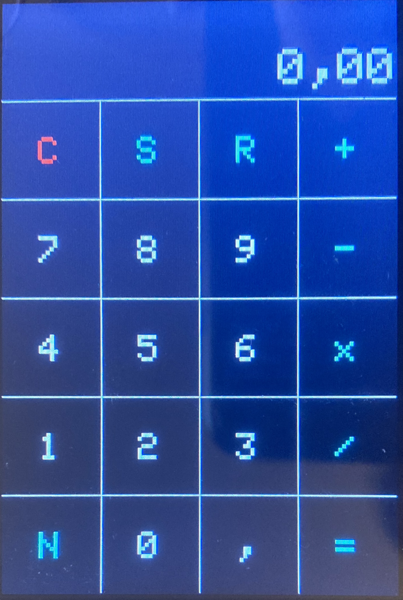

# Taschenrechner

## Benutzeroberfläche



| Taste | Funktion                                                                 |
| ----- | -----------------------------------------------------------------------  |
| C     | Löscht alle aktuellen Eingaben.                                          |
| S     | Quadriert das aktuelle Ergebnis.                                         |
| R     | Zieht die Quadratwurzel aus dem aktuellen Ergebnis.                      |
| N     | Kehrt das Vorzeichen des aktuellen Ergebnisses um.                       |
| ,     | Wechselt zum Eingeben der Nachkommastellen (Zahl wird grün dargestellt). |

## Aufbau

Die Bedienung erfolgt mit einem 3,5-Zoll-Touchdisplay, welches den Display-Treiber ILI9486 nutzt.

In der Datei `TouchCalculator.ino` kann die Pin-Belegung angepasst werden:

```C++
// LCD
uint16_t model = ILI9486;
uint8_t cs = A3;
uint8_t cd = A2;
uint8_t wr = A1;
uint8_t rd = A0;
uint8_t reset = A4;

// Touchscreen
const uint8_t yp = A3;
const uint8_t xm = A2;
const uint8_t ym = 9;
const uint8_t xp = 8;
const uint16_t rxplate = 300;
```

## Verwendete Bibliotheken

* [TouchScreen.h/LCDWIKI_KBV.h/LCDWIKI_GUI.h](http://lcdwiki.com/3.5inch_Arduino_Display-UNO) (Download unter `Program Download`)
